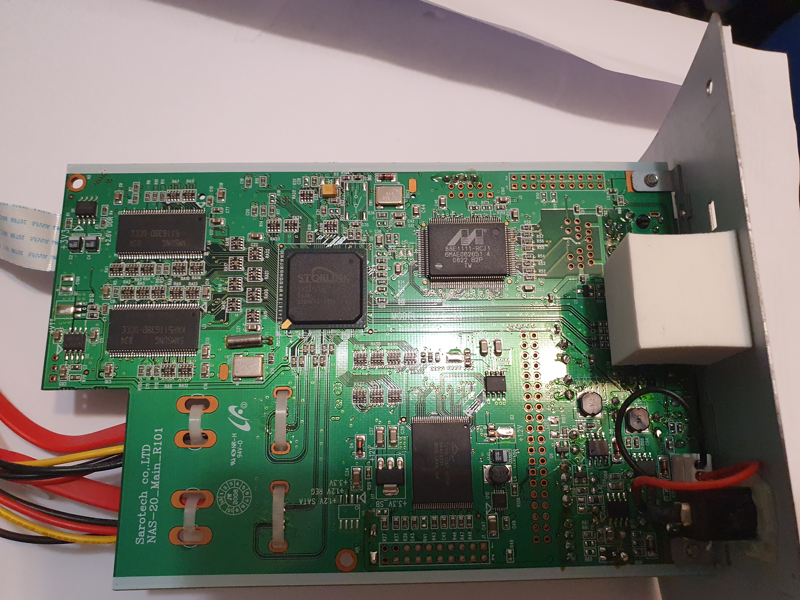
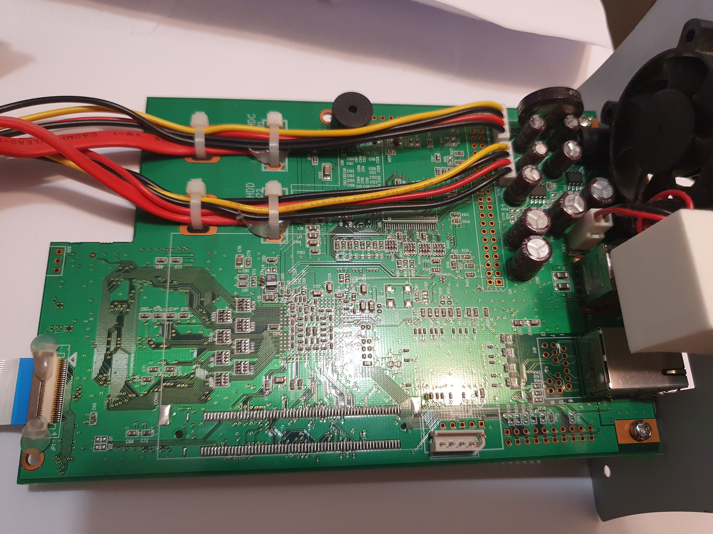
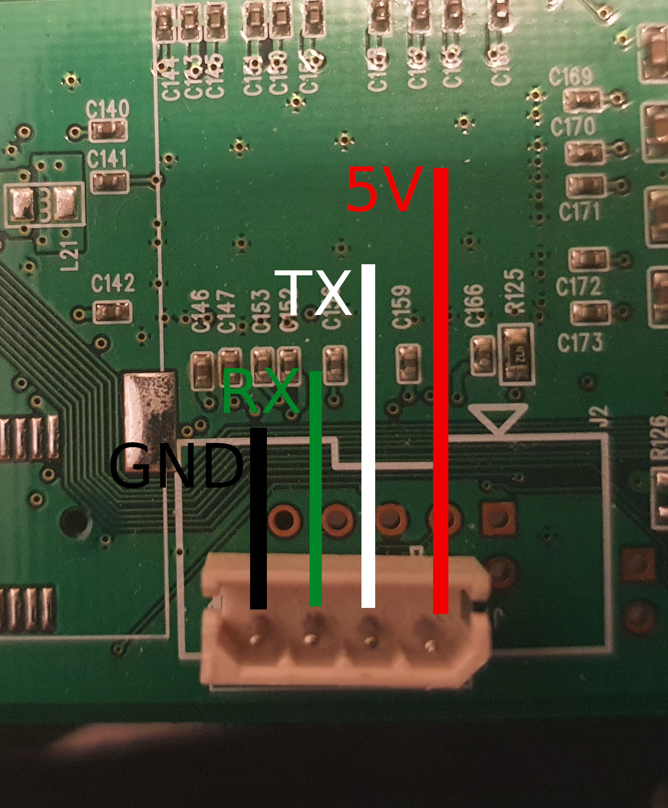
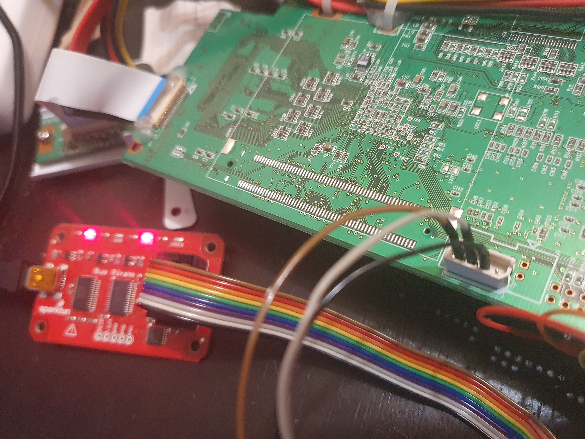

# Repairing and Upgrading a Sarotech/Wizplat NAS-20, in 2021

The Wizplat NAS-20 is a cheap NAS box running linux. I got a free one, with the
hardware in good condition, but unresponsive: connecting the device to the network
and starting it would power up the Ethernet link, but not generate any traffic.

## Disassembly

The device was easy to disassemble, using only a couple of standard screws at the front and back.
It contains a single circuit board, fitted between the two hard disk slots. Here are some pictures
of the board:



On the top side of the board, we can identify the following components,
and identify them with a web search. From left to right, we have:

  - Two DDR SDRAM chips, with a capacity of 64 MiB each (Samsung K4H51638D-UCCC)
  - A System-on-Chip (SoC) containing an ARM CPU and several integrated peripherals (Storlink SL3516/Cortina CS3516)
  - A Gigabit Ethernet tranceiver (Marvell 88E1111-RCJ1)
  - A 16MiB flash memory chip (Cypress S29GL128P)



On the underside of the board, we find:
  - Two SATA cables soldered directly to the board
  - A buzzer
  - A ribbon connector going to the front panel, bearing 8 LEDs
  - A mysterious unlabeled 4-pin connector


Furthering the search, we find the [OpenGemini] project, that supports a bunch of routers
and NAS boxes based on the same SoC.

The SL3516 contains an ARMv4 CPU core, and various integrated controllers (network, usb,
uart, crypto acceleration engine, among others). It is supported by Linux under the code name
"Gemini" 

## Probing the debug port

We probe the 4 pins with a multimeter, first in continuity mode when power is off. We discover
that pin 0 (leftmost) is connected to the ground (taken from the metal screw at the bottom right
side of the board.)

We then power up the board, and measure the 3 other pins in voltage mode, first in DC mode, then in AC mode.
Pin 3 (rightmost) exhibits +5V DC, with no AC component. Pin 1 exhibits around +1V, and pin 2 around +3.5V,
with fluctuations at boot.

At this point, I would use an oscilloscope or logic analyzer to see what is happening on the pin;
unfortunately, I don't have access to one. So, we will take a wild guess, and assume that the connector
is wired to the serial UART of the SoC. I used a [Bus Pirate] to connect to it, but probably any FTDI cable
should work fine. According to google, the Gemini platforms typically operate the UART at 19200bps in standard mode.

The assumed pin layout would be, from left to right:

 - Ground
 - RX (terminal to device)
 - TX (device to terminal)
 - +5V source.



For the first attempt, we do not connect the RX/MOSI pin. In any case, *DO NOT CONNECT 
THE +5V PIN*.  

We connect the Bus Pirate to the host (linux) computer, and start Minicom on the new serial port
that just appeared:

```
minicom -D /dev/ttyUSB0 
```

Minicom start with hardware flow control enabled; We go to the setup menu (`Ctrl-A Z`), 
C`O`nfiguration, `Serial Port Setup`, and check that it is set to 115200bps, in standard
mode (8 data bits, no parity bit, 1 stop bit). If all is well, you should see the Bus Pirate
prompt `HiZ>`, meaning High-Z mode (the safe default of just behaving like a voltmeter.)

We key in `m` to change the mode of the Bus Pirate. In the menu, choose UART mode, then
pick a speed of 19200 bps, standard mode (8 data bits, no parity, 1 stop bit). Because pin 1 was
idling close to 4V after the boot, we choose Idle 1 (default) for the polarity. Then we key in
`(0)` to see the macro menu, and
`(2)` to start the Live monitor macro. We plug the Bus Pirate ground wire (brown) to pin 0 (ground),
the MISO wire (black) to pin 2 (TX). We leave the other wires unconnected; in particular,
do not connect the 5V supply wire.

We boot the device, and the following appears:

```
Storlink CIR Initialization
Please reboot now.

No raid assembled


Sarotech NAS, version 1.2.5_P16M
Built by linux, 08:49:04, Sep 16 2009

Processor: SL3516c3
CPU Rate: 300000000
AHB Bus Clock:150MHz    Ratio:2/1
MAC 1 Address: 00:0F:D6:xx:xx:xx
MAC 2 Address: 00:50:C2:xx:xx:xx
inet addr: 192.168.123.33/255.255.255.0
==> enter ^C to abort booting within 10 seconds ......
Load Kern image from 0x30020000 to 0x1600000 size 3145728
Load Ramdisk image from 0x30620000 to 0x800000 size 6291456
Uncompressing Linux..................................................................
Linux version 2.6.15 (root@hwjang-linux) (gcc version 3.4.4) #158 Wed Nov 18 16:51:24 CST 2009
CPU: FA526id(wb) [66015261] revision 1 (ARMv4)
Machine: GeminiA
Ignoring unrecognised tag 0x00000000
Memory policy: ECC disabled, Data cache writeback
CPU0: D VIVT write-back cache
CPU0: I cache: 16384 bytes, associativity 2, 16 byte lines, 512 sets
CPU0: D cache: 8192 bytes, associativity 2, 16 byte lines, 256 sets
Built 1 zonelists
Kernel command line: root=/dev/ram0 rw console=ttySL0,19200 initrd=0x00800000,16M ramdisk_size4
PID hash table entries: 1024 (order: 10, 16384 bytes)
Bus: 150MHz(2/1)
sl2312 console setup :
Dentry cache hash table entries: 32768 (order: 5, 131072 bytes)
Inode-cache hash table entries: 16384 (order: 4, 65536 bytes)
Memory: 128MB = 128MB total
Memory: 108544KB available (3296K code, 1270K data, 104K init)
Mount-cache hash table entries: 512
*** Page_chain_cachep Init!***
CPU: Testing write buffer coherency: ok
checking if image is initramfs...it isn't (no cpio magic); looks like an initrd
Freeing initrd memory: 16384K
NET: Registered protocol family 16
PCI: bus0: Fast back to back transfers disabled
sl2312_pci_map_irq : slot = 0  pin = 1
SCSI subsystem initialized
usbcore: registered new driver usbfs
usbcore: registered new driver hub
Initial RAID Descripter...
XOR:tx_desc = ffc00000
XOR:rx_desc = ffc01000
XOR:tx_desc_dma = 01715000
XOR:rx_desc_dma = 01716000
NetWinder Floating Point Emulator V0.97 (double precision)
Unable to handle kernel paging request at virtual address e3a02001
pgd = c0004000
[e3a02001] *pgd=00000000
Internal error: Oops: 1 [#1]
Modules linked in:
CPU: 0
PC is at kobject_hotplug+0x78/0x2c0
LR is at kobject_unregister+0x18/0x2c
pc : [<c01d9a84>]    lr : [<c01d92c8>]    Not tainted
sp : c0601f08  ip : c0601f54  fp : c0601f50
r10: 00000000  r9 : e3a02001  r8 : c0601f8c
r7 : c0359fd8  r6 : c7271ee0  r5 : c0161b48  r4 : 00000002
r3 : e3a02001  r2 : 00000001  r1 : 00000002  r0 : c0161b48
Flags: NzCv  IRQs on  FIQs on  Mode SVC_32  Segment kernel
Control: 397F  Table: 00004000  DAC: 00000017
Process swapper (pid: 1, stack limit = 0xc0600194)
Stack: (0xc0601f08 to 0xc0602000)
1f00:                   c0601f2c c7273c00 c032f04c 00000003 00000000 c0361b5c
1f20: 00000000 c7271ee0 c7271ee0 00000001 00000009 c0359fd8 c0601f8c 00000001
1f40: c0359fec c0601f64 c0601f54 c01d92c8 c01d9a1c c7271ee0 c0601f84 c0601f68
1f60: c0012b38 c01d92c0 00000005 0000002e 00000014 c0359fd8 c0601fcc c0601f88
1f80: c0012c74 c0012ad4 c0359fd8 70756372 65746164 00000000 00000000 00000000
1fa0: 00000000 c001e7d4 c0600000 00000000 c001ee94 c001e98c 00000000 00000000
1fc0: c0601ff4 c0601fd0 c0022114 c0012b58 00000001 00000000 00000000 00000000
1fe0: 00000000 00000000 00000000 c0601ff8 c003b470 c0022074 840084fb 05807aee
Backtrace:
[<c01d9a0c>] (kobject_hotplug+0x0/0x2c0) from [<c01d92c8>] (kobject_unregister+0x18/0x2c)
[<c01d92b0>] (kobject_unregister+0x0/0x2c) from [<c0012b38>] (kernel_param_sysfs_setup+0x74/0x)
 r4 = C7271EE0
[<c0012ac4>] (kernel_param_sysfs_setup+0x0/0x84) from [<c0012c74>] (param_sysfs_init+0x12c/0x1)
 r7 = C0359FD8  r6 = 00000014  r5 = 0000002E  r4 = 00000005
[<c0012b48>] (param_sysfs_init+0x0/0x178) from [<c0022114>] (init+0xb0/0x258)
[<c0022064>] (init+0x0/0x258) from [<c003b470>] (do_exit+0x0/0xb3c)
 r8 = 00000000  r7 = 00000000  r6 = 00000000  r5 = 00000000
 r4 = 00000000
Code: 0afffffb e5953044 e3530000 11a09003 (e5993000)
 <0>Kernel panic - not syncing: Attempted to kill init!
```

We have a working bootloader; but the kernel crashes early on boot, apparently because of some
memory problem.

## Accessing the debug console

Now that we know that the UART console reception is working, we can set up the other direction.
For this, we will set the Bus Pirate in UART transparent mode. This requires the virtual serial
port to use the same settings as the UART.

First, we key in `b` to change the virtual port speed on the Bus Pirate, and select 19200.
The device answers:

```
Adjust your terminal                                                                                                                                                                           
Space to continue 
```

 Then, we go to Minicom settings (`Ctrl-A`, `O`, `Serial port setup`) and also set the speed
to 19200. The console works again. Next, we key in
`(1)` to start the Transparent UART bridge macro. Once enabled, the only way to exit
this mode is to power-cycle the Bus Pirate.

We then connect the BusPirate MOSI (grey) wire to pin 1 (RX) on the board,
and reset the NAS. At the prompt, we hit `Ctrl-C` to enter the bootloader menu.

Note: for some reason, the system initializes differently if it powers up with the UART
RX pin connected. Power up the NAS with the grey wire disconnected; then either connect
it and hit `Ctrl-C` before the 10-second bootloader delay expires, or use the reset button
afterwards, without turning the power off.





```
==> enter ^C to abort booting within 10 seconds ......
PHY 0 Addr 1 Vendor ID: 0x01410cc2
mii_write: phy_addr=0x1 reg_addr=0x4 value=0x5e1
mii_write: phy_addr=0x1 reg_addr=0x9 value=0x300
mii_write: phy_addr=0x1 reg_addr=0x0 value=0x1200
mii_write: phy_addr=0x1 reg_addr=0x0 value=0x9200
mii_write: phy_addr=0x1 reg_addr=0x0 value=0x1200
RTC_start ...
RTC Enable ...
RTC_start: Recoder=1

                              Boot Menu
==============================================================================
T: PCB Test!!!                              Z: BootLoader Update!!!
X: Upgrade Firmware                         L: All LED & Fan (Turn ON) Test!!!
M: All LED & Fan (Turn OFF) Test!!!         S: Shut down PCB!!!
Y: Upgrade MAC                              0: Reboot
1: Start the Kernel Code                    2: List Image
3: Delete Image                             4: Create New Image
5: Enter Command Line Interface             6: Set IP Address
7: Set MAC Address                          8: Show Configuration
9: Upgrade MAC                              F: Create Default FIS
I: Initialize IDE                           X: Upgrade Boot
Y: Upgrade Kernel                           Z: Upgrade Firmware
A: Upgrade Application                      R: Upgrade RAM Disk
N: Upgrade Bootloader(SDK)

=> Select:
```

Whoever hacked this menu together apparently added some options at the top, without
checking for key conflicts. Because of this, the `Upgrade Kernel` and `Upgrade Boot`
commands are inaccessible.

Commands 2,3,4 and F are for manipulating the partition table of the flash memory:

```
=> Select: 2                                                                                                                                                                                   
                                                                                                                                                                                               
Name              FLASH addr           Mem addr    Datalen     Entry point                                                                                                                     
BOOT              0x30000000-3001FFFF  0x00000000  0x00020000  0x00000000                                                                                                                      
FIS directory     0x30FE0000-30FFFFFF  0x30FE0000  0x00001400  0x00000000                                                                                                                      
Kern              0x30020000-3031FFFF  0x01600000  0x00300000  0x01600000                                                                                                                      
Ramdisk           0x30320000-3091FFFF  0x00800000  0x00600000  0x00800000                                                                                                                      
VCTL              0x30F20000-30F3FFFF  0x00000000  0x00020000  0x00000000
```

`FIS directory` is the same name used by the [RedBoot] bootloader to store the
partition table. Could this be a disguised version of RedBoot ?

I'm not sure why the interface prints the partitions in this order. Our 16M flash
chip contains 128 sectors of 128kiB, organized as follows:

- 1 sector (128kiB) for the bootloader, that probably starts executing at 0
- 24 sectors (3MiB) for the kernel image
- 48 sectors (6MiB) for the linux initrd
- 48 unallocated sectors
- 1 sector for a "VCTL" partition (no idea what that does)
- 5 unallocated sectors
- 1 sector for the partition table

I guess the `Mem addr` and `Entry point` columns are hint for the loader. It seems
the bootloader is scripted to load the `Kern` and `Ramdisk` images at fixed
memory locations, then jumps to the kernel entry point. The kernel contains
the address of the ramdisk hardcoded in its command-line arguments.


## Building a modern kernel

We will use the [Buildroot] project, which is a collection of makefiles and scripts
to automate the software build of embedded linux systems. It can build a cross-compilation
toolchain for the host, and a kernel and root filesystem for the target.

We start by downloading the latest buildroot from the official Git repository,
and enter the configuration interface:

```
git clone git://git.buildroot.net/buildroot
cd buildroot
make menuconfig
```

The buildroot menuconfig interface, like the linux kernel one, saves its settings in a
file `.config`, in the top-level buildroot directory.
Here is the [full config](./buildroot-config) file, after making the correct choices.

Under Target Options, we choose the ARM (little endian) architecture. As we saw from the
failing boot log, the CPU inside the Storlink SoC is a Faraday 526 ARMv4 core, so we pick this
as the target variant.

The plain Linux kernel does not come with a default configuration for our obscure board.
We will specify a full custom kernel configuration file.

## Creating a Device Tree

A CPU architecture specification determines the behavior of the CPU, but not the configuration
of the entire system (and in particular, the I/O ports and/or memory addresses for the peripherals,
IRQ lines, etc). On PC platforms, such information is typically decided by the designer of
the mainboard, and then hardcoded into the firmware (BIOS or UEFI) of the board. This information
is then passed to the kernel at boot time, via ACPI tables or DMI structures.

For embedded linux, no equivalent standard existed for a long time. The bootloader would be programmed
to pass a machine ID, and optional list of extra config items, to the kernel. This is the `GeminiA`
that we can see at the very start of the boot log.

Unfortunately, this machine ID does not seem to be referenced anywhere in open-source code; the
manufacturer possibly wrote their own board description without publishing it.

With the modern technique, instead of passing an opaque machine ID, the bootloader passes a pointer
to a Device Tree Blob (DTB), a binary structure containing a description of the hardware on the board.
But on this device, upgrading the bootloader is too risky; we do not have JTAG access, and thus
no easy way to reprogram the flash if we accidentally brick the bootloader.

Fortunately, there is a way to bypass this limitation; instead of having the kernel look for a DTB
at the address passed by the bootloader, we can hardcode a single DTB in the kernel itself. That
results in a non-portable kernel that only works on this specific board.

In the Buildroot menuconfig, make sure to choose `zImage + DTB` to get a hardcoded DTB.

## Credits

This project would never have happened without the outstanding open work from the [Buildroot]
project, from [OpenGemini], and from [Linus Walleij].

[Bus Pirate]: https://dangerousprototypes.com/docs/Bus_Pirate
[Buildroot]: https://buildroot.org
[Devicetree]: https://devicetree.org
[OpenGemini]: http://opengemini.free.fr
[Linus Walleij]: https://dflund.se/~triad/krad
